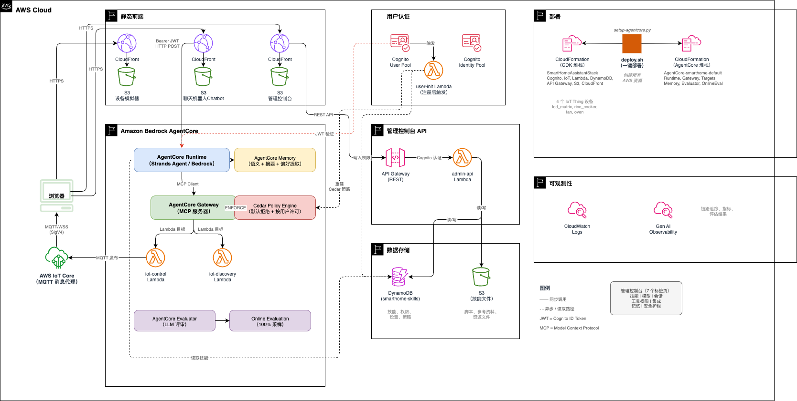
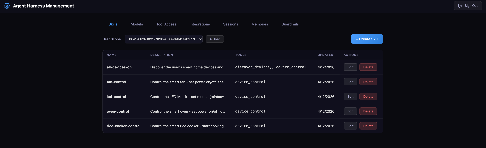

# Smart Home Assistant Agent — Agent Harness 管理平台

> **Agent Harness 管理平台**，以智能家居场景为示例，展示如何在 AWS AgentCore 上构建完整的 Agent 运维管控体系：技能编排、模型选择、工具权限（per-user Cedar 策略）、外部集成、会话监控、长期记忆查看和安全护栏。

基于 AWS AgentCore Runtime/Memory/Gateway 构建的 AI 智能家居控制系统。通过 Strands Agent 托管在 AgentCore Runtime 上，用户可以使用自然语言聊天机器人控制模拟 IoT 设备（LED 矩阵灯、电饭煲、风扇、烤箱）。设备控制命令通过 AgentCore Gateway 发送，并通过 AWS IoT Core 进行实时 MQTT 通信。管理控制台（Agent Harness Management）提供 7 个管理维度，覆盖 Agent 全生命周期的运维管控需求。






```
smarthome-assistant-agent/
├── cdk/                     # AWS CDK — Cognito, IoT Core, Lambda, DynamoDB, API Gateway, S3, CloudFront
│   ├── lib/smarthome-stack.ts
│   └── lambda/
│       ├── iot-control/     # 验证并发布 MQTT 命令
│       ├── iot-discovery/   # 返回可用设备列表
│       ├── admin-api/       # 技能、模型、工具权限、记忆、会话管理
│       └── user-init/       # Cognito 注册触发器 — 新用户自动分配工具权限
├── device-simulator/        # React 应用 — 4 个模拟 IoT 设备
├── chatbot/                 # React 应用 — 带 Cognito 认证的聊天 UI
├── admin-console/           # React 应用 — Agent Harness 管理控制台
├── agent/                   # Strands Agent（部署到 AgentCore Runtime）
│   ├── agent.py             # BedrockAgentCoreApp 入口
│   ├── skills/              # 备用设备控制 SKILL.md 文件
│   └── pyproject.toml       # AgentCore 代码打包依赖
├── scripts/
│   ├── setup-agentcore.py   # 创建 Gateway、Lambda Target、Runtime
│   ├── seed-skills.py       # 将 SKILL.md 文件写入 DynamoDB
│   └── teardown-agentcore.py
├── docs/                    # 架构与设计文档
└── deploy.sh                # 一键部署
```

## 前置条件

| 条件 | 版本 | 用途 |
|------|------|------|
| Node.js | >= 18.x | 构建 React 应用、运行 CDK |
| npm | >= 9.x | 包管理 |
| Python 3 | >= 3.12 | AgentCore 部署脚本、Agent 代码 |
| boto3 | 最新 | 部署脚本中的 AgentCore API 调用 |
| agentcore CLI | 最新 | 部署 AgentCore 资源（`pip install strands-agents-builder`） |
| AWS CLI | >= 2.x | AWS 凭证配置 |
| AWS 账号 | — | 需开通 Bedrock AgentCore 和 Kimi-2.5 模型访问权限 |

**重要：** 部署前需在 [Bedrock 控制台 > 模型访问](https://console.aws.amazon.com/bedrock/home#/modelaccess) 中申请 **Kimi K2.5**（`moonshotai.kimi-k2.5`）的访问权限。

### 部署者 IAM 权限

执行 `deploy.sh` 的 IAM 用户/角色需要以下 AWS 服务权限：

| AWS 服务 | 权限 | 用途 |
|---------|------|------|
| **CloudFormation** | `CreateStack`, `UpdateStack`, `DeleteStack`, `DescribeStacks`, `DescribeStackEvents`, `CreateChangeSet`, `DescribeChangeSet`, `ExecuteChangeSet`, `GetTemplate`, `ListStacks` | CDK 和 agentcore CLI 部署 |
| **S3** | `CreateBucket`, `DeleteBucket`, `PutObject`, `GetObject`, `DeleteObject`, `ListBucket`, `PutBucketPolicy`, `PutBucketCors`, `PutBucketVersioning`, `GetBucketLocation` | CDK 资产桶、静态网站桶、技能文件桶、config.js 写入 |
| **CloudFront** | `CreateDistribution`, `GetDistribution`, `UpdateDistribution`, `DeleteDistribution`, `CreateInvalidation` | 三个前端 CDN 分发 |
| **Lambda** | `CreateFunction`, `GetFunction`, `GetFunctionConfiguration`, `UpdateFunctionConfiguration`, `UpdateFunctionCode`, `AddPermission`, `RemovePermission`, `DeleteFunction` | 4 个 Lambda 函数（iot-control、iot-discovery、admin-api、user-init） |
| **DynamoDB** | `CreateTable`, `DeleteTable`, `DescribeTable`, `PutItem`, `Query`, `Scan` | 技能表创建 + seed-skills.py 写入初始数据 |
| **Cognito** | `CreateUserPool`, `UpdateUserPool`, `DeleteUserPool`, `CreateUserPoolClient`, `CreateUserPoolDomain`, `AdminCreateUser`, `AdminSetUserPassword`, `CreateUserPoolGroup`, `AdminAddUserToGroup` | 用户池、管理员用户、admin 组 |
| **Cognito Identity** | `CreateIdentityPool`, `SetIdentityPoolRoles`, `DeleteIdentityPool` | 设备模拟器 MQTT 认证 |
| **IoT Core** | `DescribeEndpoint`, `CreateThing`, `DeleteThing` | IoT 端点发现 + 设备 Thing 创建 |
| **IAM** | `CreateRole`, `DeleteRole`, `GetRole`, `PutRolePolicy`, `DeleteRolePolicy`, `AttachRolePolicy`, `DetachRolePolicy`, `PassRole`, `CreateServiceLinkedRole` | Lambda 执行角色、Cognito 角色、Gateway 角色 |
| **Bedrock AgentCore** | `Create/Get/Update/Delete` Gateway、AgentRuntime、PolicyEngine、Policy、Memory、Evaluator、OnlineEval；`ListGatewayTargets`、`GetGatewayTarget`、`ListPolicies`、`ListPolicyEngines` | Gateway、Runtime、策略引擎、Memory、Evaluator 全生命周期 |
| **CloudWatch Logs** | `CreateLogGroup`, `PutRetentionPolicy`, `DeleteLogGroup` | Lambda 日志组 |
| **STS** | `GetCallerIdentity` | 部署脚本获取账号 ID |

<details>
<summary>最小 IAM 策略 JSON（点击展开）</summary>

```json
{
  "Version": "2012-10-17",
  "Statement": [
    {
      "Sid": "CloudFormation",
      "Effect": "Allow",
      "Action": [
        "cloudformation:CreateStack", "cloudformation:UpdateStack", "cloudformation:DeleteStack",
        "cloudformation:DescribeStacks", "cloudformation:DescribeStackResources",
        "cloudformation:DescribeStackEvents", "cloudformation:GetTemplate",
        "cloudformation:ListStacks", "cloudformation:CreateChangeSet",
        "cloudformation:DescribeChangeSet", "cloudformation:ExecuteChangeSet"
      ],
      "Resource": [
        "arn:aws:cloudformation:*:*:stack/SmartHomeAssistantStack/*",
        "arn:aws:cloudformation:*:*:stack/AgentCore-*/*",
        "arn:aws:cloudformation:*:*:stack/CDKToolkit/*"
      ]
    },
    {
      "Sid": "S3",
      "Effect": "Allow",
      "Action": [
        "s3:CreateBucket", "s3:DeleteBucket", "s3:GetBucketLocation",
        "s3:PutBucketPolicy", "s3:GetBucketPolicy", "s3:PutBucketVersioning",
        "s3:PutBucketCors", "s3:PutObject", "s3:GetObject", "s3:DeleteObject",
        "s3:ListBucket"
      ],
      "Resource": [
        "arn:aws:s3:::smarthome-*", "arn:aws:s3:::smarthome-*/*",
        "arn:aws:s3:::cdk-*-assets-*", "arn:aws:s3:::cdk-*-assets-*/*"
      ]
    },
    {
      "Sid": "CloudFront",
      "Effect": "Allow",
      "Action": [
        "cloudfront:CreateDistribution", "cloudfront:GetDistribution",
        "cloudfront:GetDistributionConfig", "cloudfront:UpdateDistribution",
        "cloudfront:DeleteDistribution", "cloudfront:CreateInvalidation",
        "cloudfront:CreateOriginAccessControl",
        "cloudfront:CreateCloudFrontOriginAccessIdentity",
        "cloudfront:GetCloudFrontOriginAccessIdentity",
        "cloudfront:DeleteCloudFrontOriginAccessIdentity"
      ],
      "Resource": "*"
    },
    {
      "Sid": "Lambda",
      "Effect": "Allow",
      "Action": [
        "lambda:CreateFunction", "lambda:GetFunction",
        "lambda:GetFunctionConfiguration", "lambda:UpdateFunctionConfiguration",
        "lambda:UpdateFunctionCode", "lambda:AddPermission",
        "lambda:RemovePermission", "lambda:DeleteFunction",
        "lambda:InvokeFunction"
      ],
      "Resource": "arn:aws:lambda:*:*:function:smarthome-*"
    },
    {
      "Sid": "LambdaCDKCustomResource",
      "Effect": "Allow",
      "Action": [
        "lambda:CreateFunction", "lambda:GetFunction",
        "lambda:UpdateFunctionConfiguration", "lambda:UpdateFunctionCode",
        "lambda:DeleteFunction", "lambda:AddPermission",
        "lambda:RemovePermission", "lambda:InvokeFunction"
      ],
      "Resource": "arn:aws:lambda:*:*:function:SmartHomeAssistantStack-*"
    },
    {
      "Sid": "DynamoDB",
      "Effect": "Allow",
      "Action": [
        "dynamodb:CreateTable", "dynamodb:DeleteTable", "dynamodb:DescribeTable",
        "dynamodb:PutItem", "dynamodb:GetItem", "dynamodb:Query", "dynamodb:Scan"
      ],
      "Resource": "arn:aws:dynamodb:*:*:table/smarthome-skills"
    },
    {
      "Sid": "Cognito",
      "Effect": "Allow",
      "Action": [
        "cognito-idp:CreateUserPool", "cognito-idp:UpdateUserPool",
        "cognito-idp:DeleteUserPool", "cognito-idp:DescribeUserPool",
        "cognito-idp:CreateUserPoolClient", "cognito-idp:DeleteUserPoolClient",
        "cognito-idp:CreateUserPoolDomain", "cognito-idp:DeleteUserPoolDomain",
        "cognito-idp:AdminCreateUser", "cognito-idp:AdminSetUserPassword",
        "cognito-idp:AdminDeleteUser", "cognito-idp:AdminAddUserToGroup",
        "cognito-idp:CreateGroup",
        "cognito-idp:ListUsers", "cognito-idp:AdminListGroupsForUser"
      ],
      "Resource": "arn:aws:cognito-idp:*:*:userpool/*"
    },
    {
      "Sid": "CognitoIdentity",
      "Effect": "Allow",
      "Action": [
        "cognito-identity:CreateIdentityPool", "cognito-identity:DeleteIdentityPool",
        "cognito-identity:SetIdentityPoolRoles",
        "cognito-identity:DescribeIdentityPool",
        "cognito-identity:UpdateIdentityPool"
      ],
      "Resource": "*"
    },
    {
      "Sid": "IoTCore",
      "Effect": "Allow",
      "Action": [
        "iot:DescribeEndpoint", "iot:CreateThing", "iot:DeleteThing", "iot:DescribeThing"
      ],
      "Resource": "*"
    },
    {
      "Sid": "IAM",
      "Effect": "Allow",
      "Action": [
        "iam:CreateRole", "iam:DeleteRole", "iam:GetRole", "iam:ListRoles",
        "iam:PutRolePolicy", "iam:DeleteRolePolicy", "iam:GetRolePolicy",
        "iam:AttachRolePolicy", "iam:DetachRolePolicy", "iam:ListRolePolicies",
        "iam:ListAttachedRolePolicies",
        "iam:PassRole", "iam:CreateServiceLinkedRole", "iam:TagRole"
      ],
      "Resource": "*"
    },
    {
      "Sid": "BedrockAgentCore",
      "Effect": "Allow",
      "Action": "bedrock-agentcore:*",
      "Resource": "*"
    },
    {
      "Sid": "CloudWatchLogs",
      "Effect": "Allow",
      "Action": [
        "logs:CreateLogGroup", "logs:DeleteLogGroup",
        "logs:PutRetentionPolicy", "logs:DescribeLogGroups"
      ],
      "Resource": "arn:aws:logs:*:*:log-group:/aws/lambda/smarthome-*"
    },
    {
      "Sid": "CloudWatchLogsCDK",
      "Effect": "Allow",
      "Action": [
        "logs:CreateLogGroup", "logs:DeleteLogGroup",
        "logs:PutRetentionPolicy", "logs:DescribeLogGroups"
      ],
      "Resource": "arn:aws:logs:*:*:log-group:/aws/lambda/SmartHomeAssistantStack-*"
    },
    {
      "Sid": "STS",
      "Effect": "Allow",
      "Action": "sts:GetCallerIdentity",
      "Resource": "*"
    },
    {
      "Sid": "APIGateway",
      "Effect": "Allow",
      "Action": [
        "apigateway:POST", "apigateway:GET", "apigateway:PUT",
        "apigateway:DELETE", "apigateway:PATCH"
      ],
      "Resource": "arn:aws:apigateway:*::/*"
    },
    {
      "Sid": "SSM",
      "Effect": "Allow",
      "Action": "ssm:GetParameter",
      "Resource": "arn:aws:ssm:*:*:parameter/cdk-bootstrap/*"
    },
    {
      "Sid": "ECR",
      "Effect": "Allow",
      "Action": [
        "ecr:CreateRepository", "ecr:DescribeRepositories",
        "ecr:SetRepositoryPolicy", "ecr:GetRepositoryPolicy"
      ],
      "Resource": "arn:aws:ecr:*:*:repository/cdk-*"
    }
  ]
}
```

</details>

---

## 快速开始

```bash
# 1. 配置 AWS 凭证
aws configure

# 2. 设置 Python 环境
python3 -m venv venv
source venv/bin/activate
pip install strands-agents strands-agents-builder bedrock-agentcore boto3 mcp pyyaml

# 3. 一键部署
./deploy.sh
```

部署脚本执行 8 个步骤：
1. 安装 CDK 依赖
2. 构建设备模拟器（React）
3. 构建聊天机器人（React）
4. 构建管理控制台（React）
5. CDK 引导
6. **CDK 部署** — Cognito、IoT Core、Lambda、DynamoDB、API Gateway、S3 + CloudFront
7. **修复 Cognito** — 启用自助注册 + 邮箱自动验证
8. **AgentCore 部署** — Gateway + Lambda Target + Agent Runtime + 写入技能到 DynamoDB

部署完成后，脚本会输出三个前端的 URL 和管理员凭证。

---

## 工作原理

部署会创建两个独立的 CloudFormation 堆栈：

**CDK 堆栈** (`SmartHomeAssistantStack`) — 标准 AWS 资源：
- Cognito 用户池 + 身份池 + 管理员组和默认管理员用户
- IoT Core 设备 + 端点查询
- Lambda 函数：iot-control（MQTT）、iot-discovery（设备列表）、admin-api（技能、模型、工具权限、记忆、会话）、user-init（新用户自动分配工具权限）
- DynamoDB 表（smarthome-skills）用于 Agent 技能存储、用户设置和会话追踪
- S3 桶（smarthome-skill-files）用于技能目录文件（scripts、references、assets），符合 [Agent Skills 规范](https://agentskills.io/specification)
- API Gateway + Cognito 授权器用于管理 API
- S3 + CloudFront 用于设备模拟器、聊天机器人和管理控制台

**AgentCore 堆栈**（由 `agentcore` CLI 管理）— AgentCore 资源：
- AgentCore Gateway（MCP 服务器），CUSTOM_JWT 认证（Cognito）用于按用户工具策略执行
- Gateway Lambda Target 指向 iot-control 和 iot-discovery Lambda
- AgentCore Runtime 运行 Strands Agent（CodeZip，Python 3.13）
- AgentCore Memory，含语义、摘要和用户偏好提取策略

部署脚本（`scripts/setup-agentcore.py`）桥接两者：读取 CDK 输出、创建 `agentcore` 项目、注入 Agent 代码、添加 memory + gateway + targets、部署所有资源，然后配置 runtime 的 `SKILLS_TABLE_NAME`、`requestHeaderAllowlist: ["Authorization"]`（用于 JWT 转发到 gateway），并授予 DynamoDB 访问权限。最后 `scripts/seed-skills.py` 将 5 个内置技能写入 DynamoDB。

---

## 管理控制台功能

管理控制台（"Agent Harness Management"）是独立的 React 管理应用。使用 `admin` Cognito 组中的用户登录（默认管理员凭证在部署输出中显示）。

### 技能（Skills Tab）
- **完整 [Agent Skills 规范](https://agentskills.io/specification) 支持**：所有字段（名称、描述、允许工具、许可证、兼容性、元数据）均可编辑
- **全局技能**（`__global__`）对所有用户共享；**按用户技能**可覆盖同名全局技能
- 使用 Markdown 指令编辑器创建、编辑和删除技能
- **元数据编辑器**：动态键值对编辑
- **技能文件管理器**：上传、下载和删除 `scripts/`、`references/`、`assets/` 目录中的文件（存储在 S3，通过预签名 URL 管理）
- 技能存储在 DynamoDB（元数据 + 指令）和 S3（目录文件），每次调用动态加载，无需重新部署 Agent

### 模型（Models Tab）
- **全局默认模型**：通过下拉菜单为所有用户设置 LLM 模型
- **按用户模型覆盖**：表格列出所有 Cognito 用户，每行有独立的模型选择下拉框。按用户设置优先于全局默认。
- 可选模型包括 Kimi K2.5、Claude 4.5/4.6、DeepSeek、Qwen、Llama 4 和 OpenAI GPT
- Agent 在每次调用时从 DynamoDB 读取模型设置

### 工具权限（Tool Access Tab）
- **按用户工具权限**：列出所有 Cognito 用户，选择每个用户可以调用的 gateway 工具
- **策略引擎模式切换**：ENFORCE（策略阻止未授权访问）/ LOG_ONLY（仅审计）
- **AgentCore Policy Engine 集成**：通过 Cedar 策略在 gateway 层面执行权限
  - 每个工具一个 Cedar `permit` 策略，`principal.id` 匹配用户的 Cognito `sub`
  - Gateway 使用 CUSTOM_JWT 认证；Runtime 通过 `requestHeaderAllowlist: ["Authorization"]` 转发用户 JWT
  - 默认拒绝：未配置工具权限的用户无法调用 gateway 工具

### 集成（Integrations Tab）
- 显示当前工具集成类型（Lambda Targets — 已激活）和未来路线图
- 计划集成：MCP Servers、A2A Agents、API Gateway 端点

### 会话（Sessions Tab）
- 查看所有用户运行时会话（用户 ID、会话 ID、最后活跃时间）
- 每个用户有固定会话 ID（基于 Cognito 身份）
- **停止**按钮通过 AgentCore StopRuntimeSession API 终止用户会话

### 记忆（Memories Tab）
- 从 AgentCore Memory 查看每个用户的**长期记忆**
- 列出所有记忆参与者（与聊天机器人交互过的用户）
- 点击"查看记忆"显示提取的**事实**（语义知识）和**偏好**（用户偏好）
- 按创建时间倒序排列，显示类型标签、内容和时间戳

### 安全护栏（Guardrails Tab）
- 链接到 **AgentCore Evaluator** 控制台（LLM-as-a-Judge 质量评估）
- 链接到 **Bedrock Guardrails** 控制台（内容过滤、PII 脱敏）
- 快速跳转到 Tool Access tab 中的 **Cedar Policy Engine** 设置

---

## 分步部署

### 1. 构建前端

```bash
cd device-simulator && npm install && npm run build && cd ..
cd chatbot && npm install && npm run build && cd ..
cd admin-console && npm install && npm run build && cd ..
```

### 2. 部署 CDK 堆栈

```bash
cd cdk
npm install
npx cdk bootstrap  # 每个账号/区域只需一次
npx cdk deploy --all --require-approval never --outputs-file ../cdk-outputs.json
```

### 3. 部署 AgentCore

```bash
source venv/bin/activate
python3 scripts/setup-agentcore.py
```

此命令在 `.agentcore-project/` 中创建 `agentcore` CLI 项目，添加 Agent 代码、gateway 和 Lambda target，然后运行 `agentcore deploy -y --verbose`。

### 4. 写入技能

```bash
python3 scripts/seed-skills.py
```

从 `agent/skills/` 读取 SKILL.md 文件并作为 `__global__` 技能写入 DynamoDB。

### 5. 添加管理员用户（可选）

CDK 堆栈会创建默认管理员用户。添加更多管理员：

```bash
aws cognito-idp admin-add-user-to-group \
  --user-pool-id <USER_POOL_ID> \
  --username <EMAIL> \
  --group-name admin
```

---

## 本地开发

### 设备模拟器

```bash
cd device-simulator && npm install && npm start  # http://localhost:3001
```

创建 `device-simulator/public/config.js`（使用 `cdk-outputs.json` 中的值）：
```javascript
window.__CONFIG__ = {
  iotEndpoint: "YOUR_IOT_ENDPOINT",
  region: "us-west-2",
  cognitoIdentityPoolId: "YOUR_IDENTITY_POOL_ID"
};
```

### 聊天机器人

```bash
cd chatbot && npm install && npm start  # http://localhost:3000
```

创建 `chatbot/public/config.js`：
```javascript
window.__CONFIG__ = {
  cognitoUserPoolId: "YOUR_USER_POOL_ID",
  cognitoClientId: "YOUR_CLIENT_ID",
  cognitoDomain: "YOUR_DOMAIN",
  agentRuntimeArn: "YOUR_RUNTIME_ARN",
  region: "us-west-2"
};
```

### 管理控制台

```bash
cd admin-console && npm install && npm start  # http://localhost:3002
```

创建 `admin-console/public/config.js`：
```javascript
window.__CONFIG__ = {
  cognitoUserPoolId: "YOUR_USER_POOL_ID",
  cognitoClientId: "YOUR_CLIENT_ID",
  adminApiUrl: "YOUR_ADMIN_API_URL",
  agentRuntimeArn: "YOUR_RUNTIME_ARN",
  region: "us-west-2"
};
```

### Strands Agent

```bash
source venv/bin/activate
export AWS_REGION=us-west-2
export MODEL_ID=moonshotai.kimi-k2.5  # 或任何你有访问权限的 Bedrock 模型
cd agent && python agent.py  # 在 http://localhost:8080 启动服务
```

测试端点：
```bash
curl http://localhost:8080/ping
curl -X POST http://localhost:8080/invocations \
  -H "Content-Type: application/json" \
  -d '{"prompt": "把 LED 矩阵灯设为彩虹模式"}'
```

---

## 配置

### 更改 AI 模型

编辑 `agent/agent.py` 或设置 `MODEL_ID` 环境变量。默认：`moonshotai.kimi-k2.5`。管理员可通过管理控制台按用户覆盖模型，无需重新部署。

### 自定义域名

在 `cdk/lib/smarthome-stack.ts` 中添加：
```typescript
domainNames: ["chat.yourdomain.com"],
certificate: acm.Certificate.fromCertificateArn(this, "Cert", "arn:aws:acm:..."),
```

---

## 销毁资源

**顺序很重要：** AgentCore 资源必须在 CDK 堆栈之前销毁，因为 AgentCore Gateway 引用了 Lambda 函数。

```bash
source venv/bin/activate

# 1. 先销毁 AgentCore 资源（Gateway、Target、Runtime）
python3 scripts/teardown-agentcore.py

# 2. 再销毁 CDK 堆栈（Cognito、IoT、Lambda、DynamoDB、S3、CloudFront）
cd cdk && npx cdk destroy --all --force
```

销毁脚本只删除 `agentcore-state.json` 中记录的资源，不会影响无关的 AgentCore 资源。

---

## 文档

详见 [docs/architecture-and-design.md](docs/architecture-and-design.md)，包含架构图、组件设计、API 参考和 MQTT 命令模式。

---

## 故障排除

### agentcore CLI 未找到

```bash
pip install strands-agents-builder
```

### agentcore deploy 失败："Target not found in aws-targets.json"

部署脚本会自动生成此文件。手动运行时需创建：
```json
[{"name": "default", "region": "us-west-2", "account": "YOUR_ACCOUNT_ID"}]
```

### CDK synth 失败："pyproject.toml not found"

Agent 目录必须包含 `pyproject.toml`，已包含在仓库中。

### Bedrock 模型访问被拒绝

前往 [Bedrock 控制台 > 模型访问](https://console.aws.amazon.com/bedrock/home#/modelaccess) 申请 Kimi K2.5（`moonshotai.kimi-k2.5`）。注意模型 ID 是 `moonshotai.kimi-k2.5`，不是 `us.kimi.kimi-2.5`。

### 设备模拟器 MQTT 连接失败

检查浏览器控制台中的 Cognito Identity Pool ID、IoT 端点和 IAM 角色权限。

### 聊天机器人请求失败

聊天机器人使用 HTTP POST 请求 `https://bedrock-agentcore.{region}.amazonaws.com/runtimes/{arn}/invocations`。检查 config.js 中的 `agentRuntimeArn`、Cognito token 和 CloudWatch 中的 AgentCore Runtime 日志。

### 管理控制台："Access Denied"

登录用户必须属于 `admin` Cognito 组：
```bash
aws cognito-idp admin-add-user-to-group \
  --user-pool-id <USER_POOL_ID> \
  --username <EMAIL> \
  --group-name admin
```

### 管理 API 返回 403 "Forbidden: admin group required"

同上 — JWT `cognito:groups` 声明必须包含 `admin`。

### DynamoDB 技能加载失败

检查 AgentCore Runtime 是否设置了 `SKILLS_TABLE_NAME` 环境变量，以及 runtime IAM 角色是否有技能表的 `dynamodb:Query`、`dynamodb:PutItem` 权限。部署脚本会自动处理，但在重新 `agentcore deploy` 后可能需要重新运行。

### 管理控制台会话中用户 ID 显示为 "default"

聊天机器人在 POST body 中将 `userId` 传给 Agent。如果显示 "default"，可能是聊天机器人提供了缓存的旧版本。硬刷新（`Ctrl+Shift+R`）或清除 CloudFront 缓存。

### 销毁失败："Gateway has targets associated"

必须先删除 AgentCore CloudFormation 堆栈。销毁脚本会自动处理。手动操作：
```bash
aws cloudformation delete-stack --stack-name AgentCore-smarthome-default
aws cloudformation wait stack-delete-complete --stack-name AgentCore-smarthome-default
```

### S3 桶名冲突

从 CDK 堆栈中移除 `bucketName` 让 CDK 自动生成唯一名称。

### CDK 自定义资源失败："@aws-sdk/client-bedrockagentcorecontrol does not exist"

这是预期行为 — CDK JS SDK 尚不包含 AgentCore 客户端。AgentCore 资源由 `agentcore` CLI 在单独步骤（部署的第 8 步）中创建，不由 CDK 创建。

---

## 安全

详见 [CONTRIBUTING](CONTRIBUTING.md#security-issue-notifications)。

## 许可证

本项目使用 MIT-0 许可证。详见 LICENSE 文件。

---
---

# English Version

> **Agent Harness management platform**, using a smart home scenario to demonstrate how to build a complete Agent operations and governance system on AWS AgentCore: skill orchestration, model selection, tool access control (per-user Cedar policies), external integrations, session monitoring, long-term memory viewing, and safety guardrails.

AI-powered smart home control system built on AWS AgentCore Runtime/Memory/Gateway. Natural language chatbot controls simulated IoT devices (LED Matrix, Rice Cooker, Fan, Oven) through a Strands Agent hosted on AgentCore Runtime, with remote control command through AgentCore Gateway and real-time MQTT communication with AWS IoT Core. The admin console (Agent Harness Management) provides 7 management dimensions covering the full Agent lifecycle.

```
smarthome-assistant-agent/
├── cdk/                     # AWS CDK — Cognito, IoT Core, Lambda, DynamoDB, API Gateway, S3, CloudFront
│   ├── lib/smarthome-stack.ts
│   └── lambda/
│       ├── iot-control/     # Validates & publishes MQTT commands
│       ├── iot-discovery/   # Returns available device list
│       ├── admin-api/       # Skills, models, tool access, memories, sessions
│       └── user-init/       # Cognito signup trigger — auto-provision tool permissions
├── device-simulator/        # React app — 4 simulated IoT devices
├── chatbot/                 # React app — chat UI with Cognito auth
├── admin-console/           # React app — Agent Harness Management console
├── agent/                   # Strands Agent (deployed to AgentCore Runtime)
│   ├── agent.py             # BedrockAgentCoreApp entrypoint
│   ├── skills/              # Fallback device control SKILL.md files
│   └── pyproject.toml       # Dependencies for AgentCore code packaging
├── scripts/
│   ├── setup-agentcore.py   # Creates Gateway, Lambda Target, Runtime
│   ├── seed-skills.py       # Seeds SKILL.md files to DynamoDB
│   └── teardown-agentcore.py
├── docs/                    # Architecture & design documentation
└── deploy.sh                # One-click deploy
```

## Prerequisites

| Requirement | Version | Purpose |
|-------------|---------|---------|
| Node.js | >= 18.x | Build React apps, run CDK |
| npm | >= 9.x | Package management |
| Python 3 | >= 3.12 | AgentCore setup script, agent code |
| boto3 | latest | AgentCore API calls in setup script |
| agentcore CLI | latest | Deploy AgentCore resources (`pip install strands-agents-builder`) |
| AWS CLI | >= 2.x | AWS credentials |
| AWS Account | — | With Bedrock AgentCore and Kimi-2.5 model access |

**Important:** Request access to **Kimi K2.5** (`moonshotai.kimi-k2.5`) in [Bedrock Console > Model Access](https://console.aws.amazon.com/bedrock/home#/modelaccess) before deploying.

### Deployer IAM Permissions

The IAM user/role running `deploy.sh` needs the following AWS service permissions:

| AWS Service | Actions | Purpose |
|-------------|---------|---------|
| **CloudFormation** | `CreateStack`, `UpdateStack`, `DeleteStack`, `DescribeStacks`, `DescribeStackEvents`, `CreateChangeSet`, `DescribeChangeSet`, `ExecuteChangeSet`, `GetTemplate`, `ListStacks` | CDK and agentcore CLI deployment |
| **S3** | `CreateBucket`, `DeleteBucket`, `PutObject`, `GetObject`, `DeleteObject`, `ListBucket`, `PutBucketPolicy`, `PutBucketCors`, `PutBucketVersioning`, `GetBucketLocation` | CDK asset bucket, static site buckets, skill files bucket, config.js writes |
| **CloudFront** | `CreateDistribution`, `GetDistribution`, `UpdateDistribution`, `DeleteDistribution`, `CreateInvalidation` | Three frontend CDN distributions |
| **Lambda** | `CreateFunction`, `GetFunction`, `GetFunctionConfiguration`, `UpdateFunctionConfiguration`, `UpdateFunctionCode`, `AddPermission`, `RemovePermission`, `DeleteFunction` | 4 Lambda functions (iot-control, iot-discovery, admin-api, user-init) |
| **DynamoDB** | `CreateTable`, `DeleteTable`, `DescribeTable`, `PutItem`, `Query`, `Scan` | Skills table creation + seed-skills.py initial data |
| **Cognito** | `CreateUserPool`, `UpdateUserPool`, `DeleteUserPool`, `CreateUserPoolClient`, `CreateUserPoolDomain`, `AdminCreateUser`, `AdminSetUserPassword`, `CreateGroup`, `AdminAddUserToGroup` | User pool, admin user, admin group |
| **Cognito Identity** | `CreateIdentityPool`, `SetIdentityPoolRoles`, `DeleteIdentityPool` | Device simulator MQTT auth |
| **IoT Core** | `DescribeEndpoint`, `CreateThing`, `DeleteThing` | IoT endpoint discovery + device Thing creation |
| **IAM** | `CreateRole`, `DeleteRole`, `GetRole`, `PutRolePolicy`, `DeleteRolePolicy`, `AttachRolePolicy`, `DetachRolePolicy`, `PassRole`, `CreateServiceLinkedRole` | Lambda execution roles, Cognito roles, Gateway roles |
| **Bedrock AgentCore** | `Create/Get/Update/Delete` Gateway, AgentRuntime, PolicyEngine, Policy, Memory, Evaluator, OnlineEval; `ListGatewayTargets`, `GetGatewayTarget`, `ListPolicies`, `ListPolicyEngines` | Gateway, Runtime, policy engine, Memory, Evaluator lifecycle |
| **CloudWatch Logs** | `CreateLogGroup`, `PutRetentionPolicy`, `DeleteLogGroup` | Lambda log groups |
| **STS** | `GetCallerIdentity` | Setup scripts to get account ID |

<details>
<summary>Minimal IAM Policy JSON (click to expand)</summary>

```json
{
  "Version": "2012-10-17",
  "Statement": [
    {
      "Sid": "CloudFormation",
      "Effect": "Allow",
      "Action": [
        "cloudformation:CreateStack", "cloudformation:UpdateStack", "cloudformation:DeleteStack",
        "cloudformation:DescribeStacks", "cloudformation:DescribeStackResources",
        "cloudformation:DescribeStackEvents", "cloudformation:GetTemplate",
        "cloudformation:ListStacks", "cloudformation:CreateChangeSet",
        "cloudformation:DescribeChangeSet", "cloudformation:ExecuteChangeSet"
      ],
      "Resource": [
        "arn:aws:cloudformation:*:*:stack/SmartHomeAssistantStack/*",
        "arn:aws:cloudformation:*:*:stack/AgentCore-*/*",
        "arn:aws:cloudformation:*:*:stack/CDKToolkit/*"
      ]
    },
    {
      "Sid": "S3",
      "Effect": "Allow",
      "Action": [
        "s3:CreateBucket", "s3:DeleteBucket", "s3:GetBucketLocation",
        "s3:PutBucketPolicy", "s3:GetBucketPolicy", "s3:PutBucketVersioning",
        "s3:PutBucketCors", "s3:PutObject", "s3:GetObject", "s3:DeleteObject",
        "s3:ListBucket"
      ],
      "Resource": [
        "arn:aws:s3:::smarthome-*", "arn:aws:s3:::smarthome-*/*",
        "arn:aws:s3:::cdk-*-assets-*", "arn:aws:s3:::cdk-*-assets-*/*"
      ]
    },
    {
      "Sid": "CloudFront",
      "Effect": "Allow",
      "Action": [
        "cloudfront:CreateDistribution", "cloudfront:GetDistribution",
        "cloudfront:GetDistributionConfig", "cloudfront:UpdateDistribution",
        "cloudfront:DeleteDistribution", "cloudfront:CreateInvalidation",
        "cloudfront:CreateOriginAccessControl",
        "cloudfront:CreateCloudFrontOriginAccessIdentity",
        "cloudfront:GetCloudFrontOriginAccessIdentity",
        "cloudfront:DeleteCloudFrontOriginAccessIdentity"
      ],
      "Resource": "*"
    },
    {
      "Sid": "Lambda",
      "Effect": "Allow",
      "Action": [
        "lambda:CreateFunction", "lambda:GetFunction",
        "lambda:GetFunctionConfiguration", "lambda:UpdateFunctionConfiguration",
        "lambda:UpdateFunctionCode", "lambda:AddPermission",
        "lambda:RemovePermission", "lambda:DeleteFunction",
        "lambda:InvokeFunction"
      ],
      "Resource": "arn:aws:lambda:*:*:function:smarthome-*"
    },
    {
      "Sid": "LambdaCDKCustomResource",
      "Effect": "Allow",
      "Action": [
        "lambda:CreateFunction", "lambda:GetFunction",
        "lambda:UpdateFunctionConfiguration", "lambda:UpdateFunctionCode",
        "lambda:DeleteFunction", "lambda:AddPermission",
        "lambda:RemovePermission", "lambda:InvokeFunction"
      ],
      "Resource": "arn:aws:lambda:*:*:function:SmartHomeAssistantStack-*"
    },
    {
      "Sid": "DynamoDB",
      "Effect": "Allow",
      "Action": [
        "dynamodb:CreateTable", "dynamodb:DeleteTable", "dynamodb:DescribeTable",
        "dynamodb:PutItem", "dynamodb:GetItem", "dynamodb:Query", "dynamodb:Scan"
      ],
      "Resource": "arn:aws:dynamodb:*:*:table/smarthome-skills"
    },
    {
      "Sid": "Cognito",
      "Effect": "Allow",
      "Action": [
        "cognito-idp:CreateUserPool", "cognito-idp:UpdateUserPool",
        "cognito-idp:DeleteUserPool", "cognito-idp:DescribeUserPool",
        "cognito-idp:CreateUserPoolClient", "cognito-idp:DeleteUserPoolClient",
        "cognito-idp:CreateUserPoolDomain", "cognito-idp:DeleteUserPoolDomain",
        "cognito-idp:AdminCreateUser", "cognito-idp:AdminSetUserPassword",
        "cognito-idp:AdminDeleteUser", "cognito-idp:AdminAddUserToGroup",
        "cognito-idp:CreateGroup",
        "cognito-idp:ListUsers", "cognito-idp:AdminListGroupsForUser"
      ],
      "Resource": "arn:aws:cognito-idp:*:*:userpool/*"
    },
    {
      "Sid": "CognitoIdentity",
      "Effect": "Allow",
      "Action": [
        "cognito-identity:CreateIdentityPool", "cognito-identity:DeleteIdentityPool",
        "cognito-identity:SetIdentityPoolRoles",
        "cognito-identity:DescribeIdentityPool",
        "cognito-identity:UpdateIdentityPool"
      ],
      "Resource": "*"
    },
    {
      "Sid": "IoTCore",
      "Effect": "Allow",
      "Action": [
        "iot:DescribeEndpoint", "iot:CreateThing", "iot:DeleteThing", "iot:DescribeThing"
      ],
      "Resource": "*"
    },
    {
      "Sid": "IAM",
      "Effect": "Allow",
      "Action": [
        "iam:CreateRole", "iam:DeleteRole", "iam:GetRole", "iam:ListRoles",
        "iam:PutRolePolicy", "iam:DeleteRolePolicy", "iam:GetRolePolicy",
        "iam:AttachRolePolicy", "iam:DetachRolePolicy", "iam:ListRolePolicies",
        "iam:ListAttachedRolePolicies",
        "iam:PassRole", "iam:CreateServiceLinkedRole", "iam:TagRole"
      ],
      "Resource": "*"
    },
    {
      "Sid": "BedrockAgentCore",
      "Effect": "Allow",
      "Action": "bedrock-agentcore:*",
      "Resource": "*"
    },
    {
      "Sid": "CloudWatchLogs",
      "Effect": "Allow",
      "Action": [
        "logs:CreateLogGroup", "logs:DeleteLogGroup",
        "logs:PutRetentionPolicy", "logs:DescribeLogGroups"
      ],
      "Resource": "arn:aws:logs:*:*:log-group:/aws/lambda/smarthome-*"
    },
    {
      "Sid": "CloudWatchLogsCDK",
      "Effect": "Allow",
      "Action": [
        "logs:CreateLogGroup", "logs:DeleteLogGroup",
        "logs:PutRetentionPolicy", "logs:DescribeLogGroups"
      ],
      "Resource": "arn:aws:logs:*:*:log-group:/aws/lambda/SmartHomeAssistantStack-*"
    },
    {
      "Sid": "STS",
      "Effect": "Allow",
      "Action": "sts:GetCallerIdentity",
      "Resource": "*"
    },
    {
      "Sid": "APIGateway",
      "Effect": "Allow",
      "Action": [
        "apigateway:POST", "apigateway:GET", "apigateway:PUT",
        "apigateway:DELETE", "apigateway:PATCH"
      ],
      "Resource": "arn:aws:apigateway:*::/*"
    },
    {
      "Sid": "SSM",
      "Effect": "Allow",
      "Action": "ssm:GetParameter",
      "Resource": "arn:aws:ssm:*:*:parameter/cdk-bootstrap/*"
    },
    {
      "Sid": "ECR",
      "Effect": "Allow",
      "Action": [
        "ecr:CreateRepository", "ecr:DescribeRepositories",
        "ecr:SetRepositoryPolicy", "ecr:GetRepositoryPolicy"
      ],
      "Resource": "arn:aws:ecr:*:*:repository/cdk-*"
    }
  ]
}
```

</details>

---

## Quick Start

```bash
# 1. Configure AWS credentials
aws configure

# 2. Set up Python environment (for setup script + agent deps)
python3 -m venv venv
source venv/bin/activate
pip install strands-agents strands-agents-builder bedrock-agentcore boto3 mcp pyyaml

# 3. Deploy everything
./deploy.sh
```

The deploy script runs 8 steps:
1. Install CDK dependencies
2. Build Device Simulator (React)
3. Build Chatbot (React)
4. Build Admin Console (React)
5. CDK bootstrap
6. **CDK deploy** — Cognito, IoT Core, Lambda, DynamoDB, API Gateway, S3 + CloudFront
7. **Fix Cognito** — Enable self-service sign-up + email auto-verification
8. **AgentCore setup** — Gateway + Lambda Target + Agent Runtime + Seed skills to DynamoDB

After deployment, the script outputs URLs for all three frontends and admin credentials.

---

## How It Works

The deployment creates two separate CloudFormation stacks:

**CDK Stack** (`SmartHomeAssistantStack`) — standard AWS resources:
- Cognito User Pool + Identity Pool + Admin group and default admin user
- IoT Core things + endpoint lookup
- Lambda functions: iot-control (MQTT), iot-discovery (device list), admin-api (skills, models, tool access, memories, sessions), user-init (auto-provision tool permissions for new users)
- DynamoDB table (smarthome-skills) for agent skill storage, user settings, and session tracking
- S3 bucket (smarthome-skill-files) for skill directory files (scripts, references, assets) per the [Agent Skills spec](https://agentskills.io/specification)
- API Gateway with Cognito authorizer for admin API
- S3 + CloudFront for Device Simulator, Chatbot, and Admin Console

**AgentCore Stack** (managed by `agentcore` CLI) — AgentCore resources:
- AgentCore Gateway (MCP server) with CUSTOM_JWT auth (Cognito) for per-user tool policy enforcement
- Gateway Lambda Targets pointing to iot-control and iot-discovery Lambdas
- AgentCore Runtime running the Strands agent (CodeZip, Python 3.13)
- AgentCore Memory with semantic, summary, and user preference extraction strategies

The setup script (`scripts/setup-agentcore.py`) bridges them: reads CDK outputs, creates an `agentcore` project, injects our agent code, adds memory + gateway + targets, deploys everything, then patches the runtime with `SKILLS_TABLE_NAME`, `requestHeaderAllowlist: ["Authorization"]` (for JWT forwarding to gateway), and grants DynamoDB access. Finally, `scripts/seed-skills.py` populates the DynamoDB table with the 5 built-in skills.

---

## Admin Console Features

The Admin Console ("Agent Harness Management") is a separate React app for administrators. Log in with a user in the `admin` Cognito group (default admin credentials are shown in deploy output).

### Skills (Skills Tab)
- **Full [Agent Skills spec](https://agentskills.io/specification) support**: all frontmatter fields (name, description, allowed-tools, license, compatibility, metadata) are editable per skill
- **Global skills** (`__global__`) are shared across all users; **per-user skills** override global skills with the same name
- Create, edit, and delete skills with a markdown instruction editor
- **Metadata editor**: dynamic key-value pairs for custom skill metadata
- **Skill file manager**: upload, download, and delete files in `scripts/`, `references/`, and `assets/` directories per skill (stored in S3, managed via presigned URLs)
- Skills are stored in DynamoDB (metadata + instructions) and S3 (directory files), loaded dynamically per invocation — no agent redeployment needed

### Models (Models Tab)
- **Global default model**: set the LLM model for all users via a dropdown
- **Per-user model override**: table listing all Cognito users with individual model selection dropdowns. Per-user settings take priority over the global default.
- Available models include Kimi K2.5, Claude 4.5/4.6, DeepSeek, Qwen, Llama 4, and OpenAI GPT
- The agent reads the model setting from DynamoDB on each invocation

### Tool Access (Tool Access Tab)
- **Per-user tool permissions**: list all Cognito users, select which gateway tools each user can invoke
- **Policy Engine mode toggle**: switch between ENFORCE (policies block unauthorized access) and LOG_ONLY (audit only)
- **AgentCore Policy Engine integration**: permissions enforced via Cedar policies at the gateway level
  - One Cedar `permit` policy per tool, with `principal.id` matching the user's Cognito `sub`
  - Gateway uses CUSTOM_JWT auth; runtime forwards user JWT via `requestHeaderAllowlist: ["Authorization"]`
  - Default deny: users without explicit tool permissions cannot invoke gateway tools

### Integrations (Integrations Tab)
- Shows current tool integration types (Lambda Targets — active) and future roadmap
- Planned integrations: MCP Servers, A2A Agents, API Gateway endpoints

### Sessions (Sessions Tab)
- View all user runtime sessions (User ID, Session ID, Last Active)
- Each user gets a **fixed session ID** derived from their Cognito identity
- **Stop** button to terminate a user's runtime session via the AgentCore StopRuntimeSession API

### Memories (Memories Tab)
- **View long-term memory** for each user from AgentCore Memory
- Lists all memory actors (users who have interacted with the chatbot)
- Click "View Memories" to see extracted **facts** (semantic knowledge) and **preferences** (user preferences)
- Records sorted by creation time, showing type badge, content, and timestamp

### Guardrails (Guardrails Tab)
- Links to **AgentCore Evaluator** console (LLM-as-a-Judge quality evaluation)
- Links to **Bedrock Guardrails** console (content filtering, PII redaction)
- Quick link to **Cedar Policy Engine** settings in the Tool Access tab

---

## Step-by-Step Deployment

### 1. Build frontends

```bash
cd device-simulator && npm install && npm run build && cd ..
cd chatbot && npm install && npm run build && cd ..
cd admin-console && npm install && npm run build && cd ..
```

### 2. Deploy CDK stack

```bash
cd cdk
npm install
npx cdk bootstrap  # once per account/region
npx cdk deploy --all --require-approval never --outputs-file ../cdk-outputs.json
```

### 3. Deploy AgentCore

```bash
source venv/bin/activate
python3 scripts/setup-agentcore.py
```

This creates an `agentcore` CLI project in `.agentcore-project/`, adds our agent code, gateway, and Lambda target, then runs `agentcore deploy -y --verbose`.

### 4. Seed skills

```bash
python3 scripts/seed-skills.py
```

Reads the SKILL.md files from `agent/skills/` and writes them to DynamoDB as `__global__` skills.

### 5. Add admin users (optional)

The CDK stack creates a default admin user. To add more:

```bash
aws cognito-idp admin-add-user-to-group \
  --user-pool-id <USER_POOL_ID> \
  --username <EMAIL> \
  --group-name admin
```

---

## Local Development

### Device Simulator

```bash
cd device-simulator && npm install && npm start  # http://localhost:3001
```

Create `device-simulator/public/config.js` with deployed values (from `cdk-outputs.json`):
```javascript
window.__CONFIG__ = {
  iotEndpoint: "YOUR_IOT_ENDPOINT",
  region: "us-west-2",
  cognitoIdentityPoolId: "YOUR_IDENTITY_POOL_ID"
};
```

### Chatbot

```bash
cd chatbot && npm install && npm start  # http://localhost:3000
```

Create `chatbot/public/config.js`:
```javascript
window.__CONFIG__ = {
  cognitoUserPoolId: "YOUR_USER_POOL_ID",
  cognitoClientId: "YOUR_CLIENT_ID",
  cognitoDomain: "YOUR_DOMAIN",
  agentRuntimeArn: "YOUR_RUNTIME_ARN",
  region: "us-west-2"
};
```

### Admin Console

```bash
cd admin-console && npm install && npm start  # http://localhost:3002
```

Create `admin-console/public/config.js`:
```javascript
window.__CONFIG__ = {
  cognitoUserPoolId: "YOUR_USER_POOL_ID",
  cognitoClientId: "YOUR_CLIENT_ID",
  adminApiUrl: "YOUR_ADMIN_API_URL",
  agentRuntimeArn: "YOUR_RUNTIME_ARN",
  region: "us-west-2"
};
```

### Strands Agent

```bash
source venv/bin/activate
export AWS_REGION=us-west-2
export MODEL_ID=moonshotai.kimi-k2.5  # or any Bedrock model you have access to
cd agent && python agent.py  # starts server on http://localhost:8080
```

Test endpoints:
```bash
curl http://localhost:8080/ping
curl -X POST http://localhost:8080/invocations \
  -H "Content-Type: application/json" \
  -d '{"prompt": "Turn on the LED matrix to rainbow mode"}'
```

---

## Configuration

### Changing the AI Model

Edit `agent/agent.py` or set the `MODEL_ID` environment variable. Default: `moonshotai.kimi-k2.5`. Administrators can override the model per user via the Admin Console without redeploying.

### Custom Domain Names

Add to `cdk/lib/smarthome-stack.ts`:
```typescript
domainNames: ["chat.yourdomain.com"],
certificate: acm.Certificate.fromCertificateArn(this, "Cert", "arn:aws:acm:..."),
```

---

## Teardown

**Order matters:** AgentCore resources must be destroyed before the CDK stack (Cognito, Lambda, etc.) because the AgentCore Gateway references the Lambda function.

```bash
source venv/bin/activate

# 1. Tear down AgentCore resources first (Gateway, Target, Runtime)
python3 scripts/teardown-agentcore.py

# 2. Then destroy CDK stack (Cognito, IoT, Lambda, DynamoDB, S3, CloudFront)
cd cdk && npx cdk destroy --all --force
```

The teardown script only deletes resources tracked in `agentcore-state.json` — it never touches unrelated AgentCore resources.

---

## Documentation

See [docs/architecture-and-design.md](docs/architecture-and-design.md) for architecture diagrams, component design, API reference, and MQTT command schemas.

---

## Troubleshooting

### agentcore CLI not found

```bash
pip install strands-agents-builder
```

### agentcore deploy fails: "Target not found in aws-targets.json"

The setup script seeds this file automatically. If running manually, create the file:
```json
[{"name": "default", "region": "us-west-2", "account": "YOUR_ACCOUNT_ID"}]
```

### CDK synth fails: "pyproject.toml not found"

The agent directory must contain `pyproject.toml`. This is included in the repo.

### Bedrock Model Access Denied

Go to [Bedrock Console > Model Access](https://console.aws.amazon.com/bedrock/home#/modelaccess) and request access to Kimi K2.5 (`moonshotai.kimi-k2.5`). Note: the model ID is `moonshotai.kimi-k2.5`, not `us.kimi.kimi-2.5`.

### MQTT Connection Fails in Device Simulator

Check: Cognito Identity Pool ID, IoT endpoint, and IAM role permissions in browser console.

### Chatbot Request Fails

The chatbot uses HTTP POST (not WebSocket) to `https://bedrock-agentcore.{region}.amazonaws.com/runtimes/{arn}/invocations`. Check: `agentRuntimeArn` in config.js, Cognito tokens, AgentCore Runtime logs in CloudWatch.

### Admin Console: "Access Denied"

The logged-in user must belong to the `admin` Cognito group. Add them with:
```bash
aws cognito-idp admin-add-user-to-group \
  --user-pool-id <USER_POOL_ID> \
  --username <EMAIL> \
  --group-name admin
```

### Admin API returns 403 "Forbidden: admin group required"

Same as above — the JWT `cognito:groups` claim must include `admin`.

### Skills not loading from DynamoDB

Check that the AgentCore Runtime has the `SKILLS_TABLE_NAME` environment variable set and the runtime IAM role has `dynamodb:Query`, `dynamodb:PutItem` permission on the skills table. The setup script handles both, but re-running it may be needed after a fresh `agentcore deploy`.

### S3 Bucket Name Conflict

Remove `bucketName` from the CDK stack to let CDK auto-generate unique names.

### CDK custom resource fails: "@aws-sdk/client-bedrockagentcorecontrol does not exist"

This is expected — the CDK JS SDK does not yet include the AgentCore client. AgentCore resources are created by the `agentcore` CLI in a separate step (Step 8 of deploy), not by CDK.

---

## Security

See [CONTRIBUTING](CONTRIBUTING.md#security-issue-notifications) for more information.

## License

This library is licensed under the MIT-0 License. See the LICENSE file.
