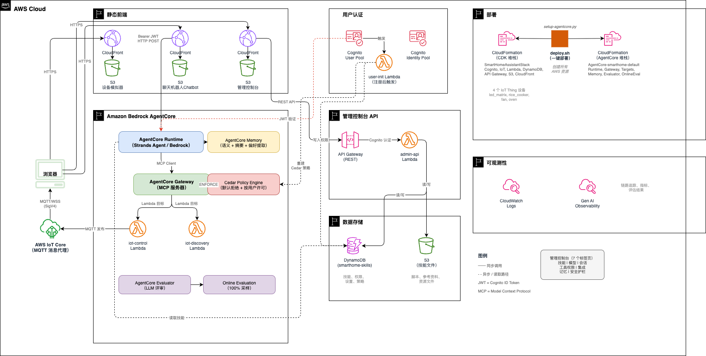
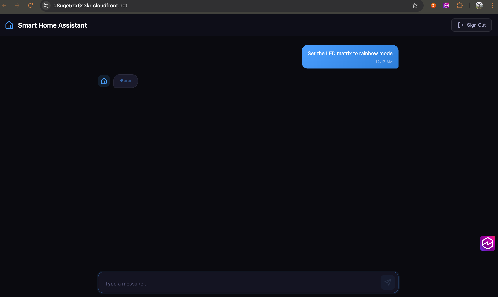
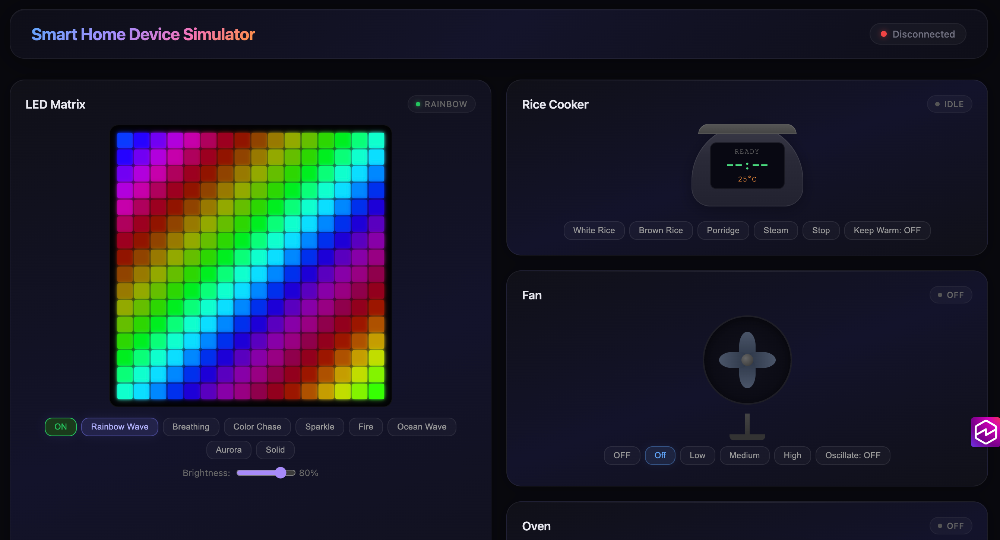
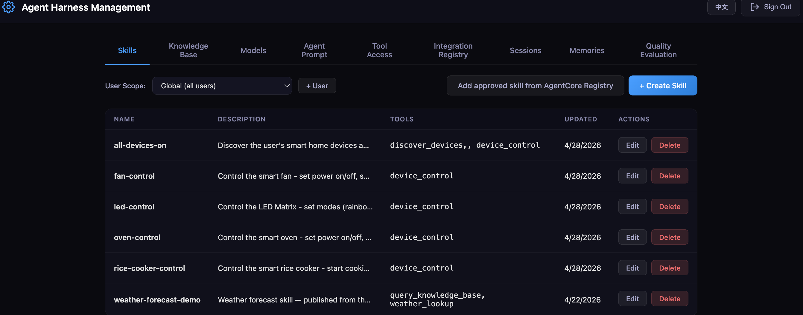

# Smart Home Assistant Agent — Agent Harness 管理平台

> **Agent Harness 管理平台**，以智能家居场景为示例，展示如何在 AWS AgentCore 上构建完整的 Agent 运维管控体系：技能编排、模型选择、工具权限（per-user Cedar 策略）、**企业知识库**、外部集成、会话监控、长期记忆查看和质量评估。

基于 AWS AgentCore Runtime/Memory/Gateway 构建的 AI 智能家居控制系统。用户可以通过聊天机器人用**自然语言文字**或**实时语音对讲**（Nova Sonic 双向流式）控制模拟 IoT 设备（LED 矩阵灯、电饭煲、风扇、烤箱）。管理控制台提供 8 个管理维度覆盖 Agent 全生命周期。**Skill ERP** 网站（新增）让普通用户可以自助发布技能到 **AgentCore Registry**，审批通过后一键导入到技能目录。

> **实现原理、架构图、协议细节** 请参见 [`docs/architecture-and-design.md`](docs/architecture-and-design.md)。本 README 专注于**部署和使用**。






## 前置条件

| 条件 | 版本 | 用途 |
|------|------|------|
| Node.js | >= 18.x | 构建 React 应用、运行 CDK |
| npm | >= 9.x | 包管理 |
| Python 3 | >= 3.12 | AgentCore 部署脚本、Agent 代码 |
| boto3 | 最新 | 部署脚本中的 AgentCore API 调用 |
| agentcore CLI | 最新 | 部署 AgentCore 资源（`pip install strands-agents-builder`） |
| AWS CLI | >= 2.x | AWS 凭证配置 |
| AWS 账号 | — | 需开通 Bedrock AgentCore、Kimi-2.5 和 Nova Sonic 模型访问权限 |

**重要：** 部署前需在 [Bedrock 控制台 > 模型访问](https://console.aws.amazon.com/bedrock/home#/modelaccess) 中申请：
- **Kimi K2.5**（`moonshotai.kimi-k2.5`）用于文字聊天
- **Amazon Nova Sonic**（`amazon.nova-2-sonic-v1:0`）用于语音对讲

### 部署者 IAM 权限

执行 `deploy.sh` 的 IAM 用户/角色需要以下 AWS 服务权限（详细清单和最小 IAM 策略 JSON 见 [docs/architecture-and-design.md §9.1](docs/architecture-and-design.md#91-two-stack-architecture)）：

| 服务 | 用途 |
|------|------|
| CloudFormation / CDK / S3 / CloudFront / Lambda / DynamoDB | 基础资源 |
| Cognito / Cognito Identity | 用户身份、Identity Pool 临时凭证 |
| IoT Core | 设备端点 + Thing |
| Bedrock / S3 Vectors | 知识库向量化 + 检索；Nova Sonic 双向流式推理 |
| Bedrock AgentCore | Gateway、Runtime、Memory、Policy Engine |
| Polly | 预渲染语音欢迎语 |
| IAM / STS / Logs / API Gateway | 角色、身份、日志、管理 API |

---

## 快速开始

```bash
# 1. 配置 AWS 凭证
aws configure

# 2. 设置 Python 环境
python3 -m venv venv
source venv/bin/activate
pip install strands-agents strands-agents-builder bedrock-agentcore boto3 mcp pyyaml

# 3. 一键部署
./deploy.sh
```

部署完成后，`deploy.sh` 会输出四个前端的 URL（设备模拟器、聊天机器人、管理控制台、Skill ERP）以及默认管理员账号。

### 部署内容概览

`deploy.sh` 是一个薄封装，按顺序运行 `scripts/0[1-7]-*.sh` 7 个脚本。每个脚本开头都会打印自己创建的 AWS 资源，方便调试或只重跑某一步。

| 步骤 | 脚本 | 职责 |
|------|------|------|
| 1 | `01-install-deps.sh` | CDK npm 依赖 + 为 Lambda 打包最新 boto3 |
| 2 | `02-build-frontends.sh` | 构建三个 React 前端产物 |
| 3 | `03-cdk-bootstrap.sh` | `cdk bootstrap`（幂等） |
| 4 | `04-cdk-deploy.sh` | 部署 CDK 堆栈：Cognito、IoT、Lambda、DynamoDB、KB、API Gateway、S3+CloudFront |
| 5 | `05-fix-cognito.sh` | 开启自助注册 + 邮箱自动验证 |
| 6 | `06-deploy-agentcore.sh` | 部署 AgentCore 堆栈：Gateway、Target、Runtime（含预渲染语音欢迎语）、Memory；授权 Cognito 身份池调用 Runtime；停掉旧会话以便新代码立即生效 |
| 7 | `07-seed-skills.sh` | 将 `agent/skills/` 下的内置技能写入 DynamoDB |

> **部分重跑：** 只改了前端 → 重跑 2 + 4；只改了 Agent Python 代码 → 重跑 6；只换了内置技能文件 → 重跑 7。

---

## 使用指南

### 聊天机器人 —— 文字与语音双模式

1. 打开部署输出里的聊天机器人 URL，注册/登录
2. 输入框左侧 🎤 按钮切换语音 / 文字模式
3. **文字模式**：输入即发，Kimi K2.5（或管理员指定的模型）回复
4. **语音模式**：浏览器弹出麦克风授权 → 听到预渲染欢迎语"欢迎使用智能家居设备助手" → 开始语音对话，Nova Sonic 双向流式处理
5. 语音模式下说"把风扇打开到中档"等指令，Agent 会通过 MCP 网关真实触发 IoT 设备命令

### 管理控制台 —— Agent Harness Management

使用部署输出中的管理员凭证登录（或在 Cognito 控制台把现有用户加到 `admin` 组）。9 个管理页签：

| 页签 | 能做什么 |
|------|---------|
| **Skills** | 创建/编辑/删除技能（支持完整 [Agent Skills 规范](https://agentskills.io/specification) 字段）；管理技能目录文件（scripts / references / assets，S3 预签名 URL 上传下载）；全局技能 + 按用户覆盖；**从 AgentCore Registry 导入已批准技能**（按全局或用户维度勾选） |
| **Knowledge Base** | 上传文档到企业知识库（PDF、TXT、MD、DOCX、CSV 等）；一键触发 Bedrock KB 向量化同步；按用户隔离（公共知识 + 用户专属） |
| **Models** | 设置全局默认 LLM 模型；按用户覆盖模型（Kimi、Claude 4.5/4.6、DeepSeek、Qwen、Llama 4、OpenAI GPT 等） |
| **Agent Prompt** | 编辑文字/语音 agent 的 system prompt（全局默认 + 按用户追加），运行时做叠加拼接 |
| **Tool Access** | 按用户配置可调用的 Gateway 工具（Cedar 策略）；切换 ENFORCE / LOG_ONLY 模式；**演示入口** 一键打开该用户的聊天机器人（URL 带 `?username=` 预填登录）与设备模拟器 |
| **Integration Registry** | 工具集成概览 + 从 AgentCore Registry 读取已批准的 **A2A Agent** 记录（A2A 子页签显示名称/端点/能力/发布者等详情） |
| **Sessions** | 查看所有活跃运行时会话（用户/会话 ID/最后活跃时间）、一键 Stop 终止、以及 **Remote Shell** 按钮（在 Runtime 容器中远程执行 shell 命令，stdout/stderr 流式回传，类似 SSH 调试工具） |
| **Memories** | 查看每个用户的长期记忆（事实 + 偏好，来自 AgentCore Memory） |
| **Quality Evaluation** | 跳转到 AgentCore Evaluator、Bedrock Guardrails 控制台 |

### Skill ERP —— 用户自助发布技能

Skill ERP 是面向**普通终端用户**的技能发布站点（不要求 `admin` 组成员），每个登录用户只能看到和管理自己创建的技能。

1. 打开部署输出里的 Skill ERP URL
2. 用自己的 Cognito 账号注册/登录（与聊天机器人共用账户体系）
3. 点击 "+ 创建技能"，填写名称/描述/指令/允许的工具/许可证/兼容性/元数据（**不支持文件上传** — AgentCore Registry 的 agentSkills 描述符只承载 SKILL.md + 定义 JSON）
4. 保存后，记录会自动以 `agentSkills` descriptorType 发布到 AgentCore Registry（`SmartHomeSkillsRegistry`），并自动触发 `SubmitRegistryRecordForApproval`
5. 状态栏会显示 `PENDING / SUBMITTED / APPROVED / REJECTED`，可以随时编辑或删除
6. 管理员在 **AgentCore Registry 控制台** 审批记录后，可在 **Admin Console → Skills → "Add approved skill from AgentCore Registry"** 将其导入技能目录

### 添加管理员用户（可选）

```bash
aws cognito-idp admin-add-user-to-group \
  --user-pool-id <USER_POOL_ID> \
  --username <EMAIL> \
  --group-name admin
```

---

## 本地开发

### 设备模拟器

```bash
cd device-simulator && npm install && npm start  # http://localhost:3001
```

创建 `device-simulator/public/config.js`（用 `cdk-outputs.json` 里的值）：
```javascript
window.__CONFIG__ = {
  iotEndpoint: "YOUR_IOT_ENDPOINT",
  region: "us-west-2",
  cognitoIdentityPoolId: "YOUR_IDENTITY_POOL_ID"
};
```

### 聊天机器人

```bash
cd chatbot && npm install && npm start  # http://localhost:3000
```

创建 `chatbot/public/config.js`：
```javascript
window.__CONFIG__ = {
  cognitoUserPoolId: "YOUR_USER_POOL_ID",
  cognitoClientId: "YOUR_CLIENT_ID",
  cognitoDomain: "YOUR_DOMAIN",
  cognitoIdentityPoolId: "YOUR_IDENTITY_POOL_ID",  // SigV4 签名所需
  agentRuntimeArn: "YOUR_RUNTIME_ARN",
  region: "us-west-2"
};
```

### 管理控制台

```bash
cd admin-console && npm install && npm start  # http://localhost:3002
```

创建 `admin-console/public/config.js`：
```javascript
window.__CONFIG__ = {
  cognitoUserPoolId: "YOUR_USER_POOL_ID",
  cognitoClientId: "YOUR_CLIENT_ID",
  adminApiUrl: "YOUR_ADMIN_API_URL",
  agentRuntimeArn: "YOUR_RUNTIME_ARN",
  region: "us-west-2"
};
```

### Skill ERP

```bash
cd skill-erp && npm install && npm start  # http://localhost:3003
```

创建 `skill-erp/public/config.js`：
```javascript
window.__CONFIG__ = {
  cognitoUserPoolId: "YOUR_USER_POOL_ID",
  cognitoClientId: "YOUR_CLIENT_ID",
  erpApiUrl: "YOUR_SKILL_ERP_API_URL",
  region: "us-west-2"
};
```

### Strands Agent

```bash
source venv/bin/activate
export AWS_REGION=us-west-2
export MODEL_ID=moonshotai.kimi-k2.5
cd agent && python agent.py  # http://localhost:8080
```

本地 smoke test：
```bash
curl http://localhost:8080/ping
curl -X POST http://localhost:8080/invocations \
  -H "Content-Type: application/json" \
  -d '{"prompt": "Turn on the LED matrix to rainbow mode"}'
```

---

## 配置与自定义

- **更换 LLM**：管理控制台 Models 页签按用户/全局覆盖，无需重新部署；或编辑 `agent/agent.py` / 设置 `MODEL_ID` 环境变量修改默认值（默认 `moonshotai.kimi-k2.5`）
- **更换语音欢迎语**：编辑 `scripts/setup-agentcore.py` 中的 Polly 文案/Voice，重跑步骤 6
- **自定义域名**：在 `cdk/lib/smarthome-stack.ts` 中为 CloudFront 分发加 `domainNames` + ACM 证书

---

## 月度成本估算

本方案全部采用 AWS Serverless 托管服务，按实际用量付费。以下按日活用户（DAU）1 万、10 万、100 万三个量级估算月度成本（us-west-2，价格截至 2025 年）。

**假设**：每用户每天 10 次对话，每次含 1 次 LLM 调用 + 1.5 次工具调用 + 0.3 次 KB 查询；LLM 为 Kimi K2.5（输入 ~800 tokens，输出 ~200 tokens）；知识库 1000 个文档（~500MB），每月同步 4 次；语音模式对话中每 10 次文本调用搭配 2 次 Nova Sonic 语音对话。

| 模块 | 服务 | 1 万 DAU | 10 万 DAU | 100 万 DAU |
|------|------|---------|----------|-----------|
| **AI Agent** | AgentCore Runtime | ~$150 | ~$1,500 | ~$15,000 |
| **文字 LLM** | Bedrock (Kimi K2.5) | ~$80 | ~$800 | ~$8,000 |
| **语音双向流** | Bedrock (Nova Sonic) | ~$50 | ~$500 | ~$5,000 |
| **工具路由** | AgentCore Gateway | ~$15 | ~$150 | ~$1,500 |
| **策略引擎** | AgentCore Policy Engine | ~$5 | ~$50 | ~$500 |
| **长期记忆** | AgentCore Memory | ~$20 | ~$200 | ~$2,000 |
| **知识库检索** | Bedrock KB (Retrieve) | ~$10 | ~$100 | ~$1,000 |
| **向量嵌入** | Bedrock (Cohere Embed) | ~$2 | ~$2 | ~$2 |
| **向量存储** | S3 Vectors | <$1 | ~$5 | ~$50 |
| **设备控制 / 管理 API / 其他 Lambda** | Lambda + API Gateway | ~$5 | ~$40 | ~$400 |
| **用户认证** | Cognito（前 50K MAU 免费） | $0 | ~$250 | ~$4,500 |
| **前端托管 / 数据存储** | S3 + CloudFront + DynamoDB | ~$10 | ~$70 | ~$600 |
| **质量评估** | AgentCore Evaluator | ~$10 | ~$100 | ~$1,000 |
| | **月度总计** | **~$358** | **~$3,767** | **~$39,552** |
| | **每用户每月** | **~$0.036** | **~$0.038** | **~$0.040** |

**Serverless 成本优势**：无运维、无空闲成本、线性扩展、规模经济递减。**S3 Vectors** 是按向量计费的纯 Serverless 服务，1 万 DAU 场景下每月不到 $1；之前的方案使用 OpenSearch Serverless 有 ~$350/月 的底价。

> 以上为估算值，实际成本取决于具体使用模式。建议使用 [AWS Pricing Calculator](https://calculator.aws/) 精确计算。

---

## Voice Agent 启动延迟测试

项目根目录的 `voice-latency-test/` 是一个**自包含**的 Playwright 测试方案，用于测量 Voice Agent 从点击按钮到听到首帧回应的延迟。`deploy.sh` 完成后直接可用，不需要额外配置——脚本会自动从 `cdk-outputs.json` + `agentcore-state.json` 读取 Chatbot URL、Voice Runtime ARN 和 region。

两种测试模式：

| 模式 | 模拟场景 | 单轮 | 100 轮 |
|---|---|---:|---:|
| `run-session-cold.sh` | 老用户回来点语音（测服务端 Python worker 冷启动）| ~18 s | ~30 min |
| `run-fresh-login.sh` | 新用户登录后立即点语音（测端到端用户旅程 + 前端优化）| ~60 s | ~100 min |

```bash
cd voice-latency-test
npm install && npx playwright install chromium    # 仅首次
./run-session-cold.sh                              # 或 ./run-fresh-login.sh
```

输出写入 `voice-latency-test/results/`（原始 JSONL + 聚合 markdown 报告）。详细协议、两种模式的完整对比、以及已实施的 16 项延迟优化清单见 `voice-latency-test/README.md` 和 `voice-latency-test/test-modes.md`。

---

## 销毁资源

**顺序很重要：** AgentCore 资源必须在 CDK 堆栈之前销毁。

```bash
source venv/bin/activate

# 1. 先销毁 AgentCore（Gateway、Target、Runtime、Memory）
python3 scripts/teardown-agentcore.py

# 2. 再销毁 CDK 堆栈
cd cdk && npx cdk destroy --all --force
```

销毁脚本只删除 `agentcore-state.json` 中记录的资源。

---

## 故障排除

### 部署相关

- **`agentcore CLI not found`** → `pip install strands-agents-builder`
- **`agentcore deploy fails: Target not found in aws-targets.json`** → 部署脚本会自动生成，手动跑的话创建 `[{"name": "default", "region": "us-west-2", "account": "YOUR_ACCOUNT_ID"}]`
- **`CDK synth fails: pyproject.toml not found`** → `agent/pyproject.toml` 必须存在（仓库已含）
- **`Bedrock Model Access Denied`** → Bedrock 控制台申请 Kimi K2.5 + Nova Sonic 访问权限
- **`@aws-sdk/client-bedrockagentcorecontrol does not exist`** → 正常，AgentCore 资源由 `agentcore` CLI 创建（步骤 6），不由 CDK 直接创建
- **销毁失败 `Gateway has targets associated`** → 销毁脚本会按顺序处理；手动跑时 `aws cloudformation delete-stack --stack-name AgentCore-smarthome-default`
- **`create_registry failed: ServiceQuotaExceededException ... maximum number of registries (5)`** → 账号已经达到 AgentCore Registry 的默认配额（5）。如果该账号已经有名为 `SmartHomeSkillsRegistry` 的 Registry，部署脚本会自动复用；否则需在 AWS Service Quotas 控制台申请提额，或删除不用的 Registry。
- **`boto3 is too old — missing bedrock-agentcore-control.create_registry`** → venv 中的 boto3 低于 1.42.93。重跑 `scripts/01-install-deps.sh`（会自动升级），或 `pip install --upgrade boto3`。
- **Skill ERP 新建技能后卡在 DRAFT 状态** → 表示 `SubmitRegistryRecordForApproval` 在记录仍处于 `CREATING` 时被调用。最新 Lambda 会轮询 `GetRegistryRecord` 直到状态脱离 `CREATING` 再提交，更新 Lambda 代码即可（重跑 `scripts/04-cdk-deploy.sh` 或 `aws lambda update-function-code`）。

### 前端相关

- **设备模拟器 MQTT 失败** → 浏览器控制台检查 Cognito Identity Pool ID、IoT 端点、IAM 角色
- **聊天机器人 403 / AccessDenied** → 确认 `config.js` 的 `cognitoIdentityPoolId`、`agentRuntimeArn` 正确；Cognito 身份池**已认证角色** 必须有 `bedrock-agentcore:InvokeAgentRuntime*` 权限（`scripts/setup-agentcore.py` 第 6 步会授权）
- **语音模式立即断开** → 已认证角色缺少 `bedrock-agentcore:InvokeAgentRuntimeWithWebSocketStream`；或 Runtime 的 `authorizerConfiguration` 未清空
- **语音模式连上但听不到 Nova Sonic 回复** → DevTools → Network → `/ws` 行 → Messages，若能看到 `bidi_audio_stream` 说明服务端正常；通常是浏览器 `AudioContext` 需用户交互后才能播放，点击页面任意位置再试
- **语音欢迎语没播** → 多半是刚部署完有旧会话缓存了老代码；`scripts/setup-agentcore.py` 会自动停掉 DynamoDB 里记录的会话，但如果用户是在部署**之前**就已连接的，重新登录一次即可

### 管理控制台相关

- **`Access Denied`** → 登录用户必须在 Cognito `admin` 组
- **管理 API 403 `Forbidden: admin group required`** → JWT `cognito:groups` claim 必须含 `admin`
- **技能加载失败 / 会话显示 "default"** → 检查 AgentCore Runtime 的 `SKILLS_TABLE_NAME` 环境变量和 DynamoDB 权限；聊天机器人硬刷新（`Ctrl+Shift+R`）清缓存

---

## 文档

| 文档 | 内容 |
|------|------|
| 本 README | 部署、使用、本地开发、成本估算、故障排除 |
| [`docs/architecture-and-design.md`](docs/architecture-and-design.md) | 架构图、组件设计、认证模型、语音模式实现细节、AgentCore CLI 坑、API 参考、MQTT 命令、技术选型 |

---

## 安全

详见 [CONTRIBUTING](CONTRIBUTING.md#security-issue-notifications)。

## 许可证

本项目使用 MIT-0 许可证。详见 LICENSE 文件。

---
---

# English Version

> **Agent Harness management platform**, using a smart home scenario to demonstrate how to build a complete Agent operations and governance system on AWS AgentCore: skill orchestration, model selection, tool access control (per-user Cedar policies), **enterprise knowledge base (on S3 Vectors)**, **Integration Registry (A2A agents)**, session monitoring (with **Remote Shell** debug console), long-term memory viewing, and safety guardrails.

AI-powered smart home control system built on AWS AgentCore Runtime/Memory/Gateway. Users chat with the assistant via **natural-language text** or **real-time voice conversation** (Amazon Nova Sonic bi-directional streaming) to control simulated IoT devices (LED Matrix, Rice Cooker, Fan, Oven). The admin console provides 9 management dimensions covering the full Agent lifecycle, including a **Remote Shell** per-session debug console. A new **Skill ERP** site lets end users publish their own skills and A2A agents to **AgentCore Registry**; admins can then one-click import approved records into the skills catalog or browse A2A agents in the Integration Registry. The enterprise knowledge base uses the new **S3 Vectors** serverless store (pay-per-vector, no fixed cost).

> **Implementation details, architecture diagrams, protocol specs** live in [`docs/architecture-and-design.md`](docs/architecture-and-design.md). This README focuses on **deployment and usage**.

## Prerequisites

| Requirement | Version | Purpose |
|-------------|---------|---------|
| Node.js | >= 18.x | Build React apps, run CDK |
| npm | >= 9.x | Package management |
| Python 3 | >= 3.12 | AgentCore setup script, agent code |
| boto3 | latest | AgentCore API calls in setup script |
| agentcore CLI | latest | Deploy AgentCore resources (`pip install strands-agents-builder`) |
| AWS CLI | >= 2.x | AWS credentials |
| AWS Account | — | With Bedrock AgentCore, Kimi-2.5 and Nova Sonic model access |

**Important:** In [Bedrock Console > Model Access](https://console.aws.amazon.com/bedrock/home#/modelaccess), request access to:
- **Kimi K2.5** (`moonshotai.kimi-k2.5`) for text chat
- **Amazon Nova Sonic** (`amazon.nova-2-sonic-v1:0`) for voice conversation

### Deployer IAM Permissions

The IAM user/role running `deploy.sh` needs permissions for (full list + minimal IAM policy JSON in [docs/architecture-and-design.md §9.1](docs/architecture-and-design.md#91-two-stack-architecture)):

| Service | Purpose |
|---------|---------|
| CloudFormation / CDK / S3 / CloudFront / Lambda / DynamoDB | Core infrastructure |
| Cognito / Cognito Identity | User auth, Identity Pool temporary credentials |
| IoT Core | Endpoint + Things |
| Bedrock / S3 Vectors | KB vectorization + retrieval; Nova Sonic bi-directional streaming |
| Bedrock AgentCore | Gateway, Runtime, Memory, Policy Engine |
| Polly | Pre-render voice welcome clip |
| IAM / STS / Logs / API Gateway | Roles, identity, logging, admin API |

---

## Quick Start

```bash
# 1. Configure AWS credentials
aws configure

# 2. Set up Python environment
python3 -m venv venv
source venv/bin/activate
pip install strands-agents strands-agents-builder bedrock-agentcore boto3 mcp pyyaml

# 3. Deploy everything
./deploy.sh
```

After deployment, `deploy.sh` prints URLs for all four frontends (device simulator, chatbot, admin console, Skill ERP) and the default admin credentials.

### Deployment Overview

`deploy.sh` is a thin wrapper that runs `scripts/0[1-7]-*.sh` in order. Each script prints the AWS resources it creates so you can debug or re-run a single step.

| Step | Script | Responsibility |
|------|--------|----------------|
| 1 | `01-install-deps.sh` | CDK npm deps + bundle latest boto3 into Lambda dirs |
| 2 | `02-build-frontends.sh` | Build the 3 React frontends |
| 3 | `03-cdk-bootstrap.sh` | `cdk bootstrap` (idempotent) |
| 4 | `04-cdk-deploy.sh` | Deploy CDK stack: Cognito, IoT, Lambda, DynamoDB, KB, API Gateway, S3+CloudFront |
| 5 | `05-fix-cognito.sh` | Enable self-signup + email verification |
| 6 | `06-deploy-agentcore.sh` | Deploy AgentCore stack: Gateway, Targets, Runtime (with pre-rendered welcome audio), Memory; grant Cognito Identity Pool access to Runtime; stop old sessions so the fresh code takes effect immediately |
| 7 | `07-seed-skills.sh` | Write `agent/skills/*/SKILL.md` into DynamoDB |

> **Partial re-runs:** changed frontend only → rerun 2 + 4; changed agent code only → rerun 6; changed built-in skill files only → rerun 7.

---

## Usage

### Chatbot — Text and Voice Modes

1. Open the chatbot URL from the deploy output, sign up / sign in
2. 🎤 button left of the input box toggles voice / text mode
3. **Text mode**: type and send, Kimi K2.5 (or per-user overridden model) responds
4. **Voice mode**: browser prompts for mic access → you hear the pre-rendered welcome clip "欢迎使用智能家居设备助手" → start talking, Nova Sonic does bi-directional streaming
5. Voice-mode commands like "打开风扇到中档" trigger actual MQTT device commands via the MCP gateway

### Admin Console — Agent Harness Management

Log in with the admin credentials from deploy output (or add a user to the `admin` Cognito group). Nine tabs:

| Tab | What you can do |
|-----|-----------------|
| **Skills** | Create/edit/delete skills with full [Agent Skills spec](https://agentskills.io/specification) fields; manage skill directory files (scripts / references / assets via S3 presigned URLs); global skills + per-user overrides; **import approved records from AgentCore Registry** (select global or per-user scope) |
| **Knowledge Base** | Upload documents to the enterprise KB (PDF, TXT, MD, DOCX, CSV, ...); one-click Bedrock KB vectorization sync; per-user isolation (shared + user-scoped) |
| **Models** | Set the global default LLM; override per user (Kimi, Claude 4.5/4.6, DeepSeek, Qwen, Llama 4, OpenAI GPT, ...) |
| **Agent Prompt** | Edit the text / voice agent system prompts (global default + per-user addendum); runtime concatenates additively |
| **Tool Access** | Configure per-user gateway tool permissions (Cedar policies); toggle ENFORCE / LOG_ONLY; **Demo Links** column to open that user's chatbot (URL prefilled with `?username=`) and device simulator in new tabs |
| **Integration Registry** | Tool integration overview + **A2A Agents sub-tab**: lists approved A2A records from AgentCore Registry with endpoint / auth / capabilities / publisher; details drawer shows the full agent card (skills, examples, tags) |
| **Sessions** | View active runtime sessions (user / session ID / last active); Stop a session with one click; **Remote Shell** button opens a modal that runs a shell command inside the runtime container (text or voice) and streams stdout/stderr back live — admin-only SSH-style debug console |
| **Memories** | View each user's long-term memory (facts + preferences, from AgentCore Memory) |
| **Quality Evaluation** | Links to AgentCore Evaluator, Bedrock Guardrails consoles |

### Skill ERP — end-user skill publishing

Skill ERP is a self-service skills site for **regular end users** (no `admin` group required). Each signed-in user sees and edits only the records they created.

1. Open the Skill ERP URL from the deploy output
2. Sign up / sign in with any Cognito account (the same user pool as the chatbot)
3. Click "+ Create Skill" and fill in name / description / instructions / allowed tools / license / compatibility / metadata (**no file upload** — AgentCore Registry's agentSkills descriptor only carries SKILL.md + definition JSON)
4. On save, the record is published to AgentCore Registry (`SmartHomeSkillsRegistry`) with `descriptorType=agentSkills` and auto-submitted for approval (`SubmitRegistryRecordForApproval`)
5. Status column shows `PENDING / SUBMITTED / APPROVED / REJECTED` — you can keep editing or delete at any time
6. After the curator approves the record in the AgentCore Registry console, an admin can import it into the skills catalog via **Admin Console → Skills → "Add approved skill from AgentCore Registry"**

### Add Admin Users (Optional)

```bash
aws cognito-idp admin-add-user-to-group \
  --user-pool-id <USER_POOL_ID> \
  --username <EMAIL> \
  --group-name admin
```

---

## Local Development

### Device Simulator

```bash
cd device-simulator && npm install && npm start  # http://localhost:3001
```

Create `device-simulator/public/config.js` with deployed values (from `cdk-outputs.json`):
```javascript
window.__CONFIG__ = {
  iotEndpoint: "YOUR_IOT_ENDPOINT",
  region: "us-west-2",
  cognitoIdentityPoolId: "YOUR_IDENTITY_POOL_ID"
};
```

### Chatbot

```bash
cd chatbot && npm install && npm start  # http://localhost:3000
```

Create `chatbot/public/config.js`:
```javascript
window.__CONFIG__ = {
  cognitoUserPoolId: "YOUR_USER_POOL_ID",
  cognitoClientId: "YOUR_CLIENT_ID",
  cognitoDomain: "YOUR_DOMAIN",
  cognitoIdentityPoolId: "YOUR_IDENTITY_POOL_ID",  // required for SigV4 signing
  agentRuntimeArn: "YOUR_RUNTIME_ARN",
  region: "us-west-2"
};
```

### Admin Console

```bash
cd admin-console && npm install && npm start  # http://localhost:3002
```

Create `admin-console/public/config.js`:
```javascript
window.__CONFIG__ = {
  cognitoUserPoolId: "YOUR_USER_POOL_ID",
  cognitoClientId: "YOUR_CLIENT_ID",
  adminApiUrl: "YOUR_ADMIN_API_URL",
  agentRuntimeArn: "YOUR_RUNTIME_ARN",
  region: "us-west-2"
};
```

### Skill ERP

```bash
cd skill-erp && npm install && npm start  # http://localhost:3003
```

Create `skill-erp/public/config.js`:
```javascript
window.__CONFIG__ = {
  cognitoUserPoolId: "YOUR_USER_POOL_ID",
  cognitoClientId: "YOUR_CLIENT_ID",
  erpApiUrl: "YOUR_SKILL_ERP_API_URL",
  region: "us-west-2"
};
```

### Strands Agent

```bash
source venv/bin/activate
export AWS_REGION=us-west-2
export MODEL_ID=moonshotai.kimi-k2.5
cd agent && python agent.py  # starts on http://localhost:8080
```

Local smoke test:
```bash
curl http://localhost:8080/ping
curl -X POST http://localhost:8080/invocations \
  -H "Content-Type: application/json" \
  -d '{"prompt": "Turn on the LED matrix to rainbow mode"}'
```

---

## Configuration & Customization

- **Change the LLM**: use Models tab in the admin console for per-user/global override (no redeploy); or edit `agent/agent.py` / set `MODEL_ID` env var for the default (defaults to `moonshotai.kimi-k2.5`)
- **Change the voice welcome clip**: edit the Polly text/voice in `scripts/setup-agentcore.py`, re-run step 6
- **Custom domain**: add `domainNames` + ACM certificate to the CloudFront distributions in `cdk/lib/smarthome-stack.ts`

---

## Monthly Cost Estimation

Fully AWS Serverless, pay-per-use. Estimates below are for 10K / 100K / 1M Daily Active Users (us-west-2, 2025 pricing).

**Assumptions**: each user averages 10 conversations/day with 1 LLM call + 1.5 tool calls + 0.3 KB queries; LLM is Kimi K2.5 (~800 input tokens, ~200 output); KB has 1,000 docs (~500MB), synced 4x/month; roughly 2 of every 10 conversations use Nova Sonic voice mode.

| Module | Service | 10K DAU | 100K DAU | 1M DAU |
|--------|---------|---------|----------|--------|
| **AI Agent** | AgentCore Runtime | ~$150 | ~$1,500 | ~$15,000 |
| **Text LLM** | Bedrock (Kimi K2.5) | ~$80 | ~$800 | ~$8,000 |
| **Voice bi-di stream** | Bedrock (Nova Sonic) | ~$50 | ~$500 | ~$5,000 |
| **Tool Routing** | AgentCore Gateway | ~$15 | ~$150 | ~$1,500 |
| **Policy Engine** | AgentCore Policy Engine | ~$5 | ~$50 | ~$500 |
| **Long-term Memory** | AgentCore Memory | ~$20 | ~$200 | ~$2,000 |
| **KB Retrieval** | Bedrock KB (Retrieve) | ~$10 | ~$100 | ~$1,000 |
| **Vector Embedding** | Bedrock (Cohere Embed) | ~$2 | ~$2 | ~$2 |
| **Vector Store** | S3 Vectors | <$1 | ~$5 | ~$50 |
| **Device control / Admin API / other Lambda** | Lambda + API Gateway | ~$5 | ~$40 | ~$400 |
| **Authentication** | Cognito (first 50K MAU free) | $0 | ~$250 | ~$4,500 |
| **Frontend hosting / Data storage** | S3 + CloudFront + DynamoDB | ~$10 | ~$70 | ~$600 |
| **Quality Evaluation** | AgentCore Evaluator | ~$10 | ~$100 | ~$1,000 |
| | **Monthly Total** | **~$358** | **~$3,767** | **~$39,552** |
| | **Per User / Month** | **~$0.036** | **~$0.038** | **~$0.040** |

**Serverless advantages**: zero ops, zero idle cost, linear scaling, decreasing per-user cost at scale. **S3 Vectors** is fully pay-per-vector with no floor; at 10K DAU the vector store costs under $1/month. The previous setup used OpenSearch Serverless (~$350/month minimum).

> These are estimates. Use the [AWS Pricing Calculator](https://calculator.aws/) for precise numbers.

---

## Teardown

**Order matters:** AgentCore resources must be destroyed before the CDK stack.

```bash
source venv/bin/activate

# 1. Tear down AgentCore first (Gateway, Target, Runtime, Memory)
python3 scripts/teardown-agentcore.py

# 2. Then destroy CDK stack
cd cdk && npx cdk destroy --all --force
```

The teardown script only deletes resources tracked in `agentcore-state.json`.

---

## Troubleshooting

### Deployment

- **`agentcore CLI not found`** → `pip install strands-agents-builder`
- **`agentcore deploy fails: Target not found in aws-targets.json`** → setup script seeds this; if running manually, create `[{"name": "default", "region": "us-west-2", "account": "YOUR_ACCOUNT_ID"}]`
- **`CDK synth fails: pyproject.toml not found`** → `agent/pyproject.toml` must exist (included in repo)
- **`Bedrock Model Access Denied`** → request access to Kimi K2.5 + Nova Sonic in the Bedrock console
- **`@aws-sdk/client-bedrockagentcorecontrol does not exist`** → expected; AgentCore resources are created by the `agentcore` CLI (step 6), not by CDK directly
- **Teardown fails `Gateway has targets associated`** → the teardown script handles order; manually: `aws cloudformation delete-stack --stack-name AgentCore-smarthome-default`
- **`create_registry failed: ServiceQuotaExceededException ... maximum number of registries (5)`** → the account is at the AgentCore Registry default quota (5). If a registry named `SmartHomeSkillsRegistry` already exists the deploy script reuses it automatically; otherwise request a quota increase in AWS Service Quotas or delete an unused registry.
- **`boto3 is too old — missing bedrock-agentcore-control.create_registry`** → venv boto3 is older than 1.42.93. Re-run `scripts/01-install-deps.sh` (which upgrades boto3) or `pip install --upgrade boto3`.
- **Skill ERP records stuck in `DRAFT`** → `SubmitRegistryRecordForApproval` was called while the record was still `CREATING`. The current Lambda polls `GetRegistryRecord` until the record leaves `CREATING` before submitting — just push the latest code (re-run `scripts/04-cdk-deploy.sh` or `aws lambda update-function-code`).

### Frontend

- **Device simulator MQTT fails** → browser console: check Cognito Identity Pool ID, IoT endpoint, IAM role
- **Chatbot 403 / AccessDenied** → verify `cognitoIdentityPoolId` + `agentRuntimeArn` in `config.js`; the Cognito authenticated role must have `bedrock-agentcore:InvokeAgentRuntime*` (granted by `scripts/setup-agentcore.py` step 6)
- **Voice mode closes right after connect** → authenticated role is missing `bedrock-agentcore:InvokeAgentRuntimeWithWebSocketStream`, or the Runtime's `authorizerConfiguration` is not cleared
- **Voice session connects but no audio from Nova Sonic** → DevTools → Network → `/ws` row → Messages. If `bidi_audio_stream` frames are arriving the server is fine; usually the browser `AudioContext` is still locked — click anywhere on the page (browser autoplay policy) and retry
- **Welcome clip silent** → typically leftover warm containers with stale code after a redeploy; `scripts/setup-agentcore.py` auto-stops DynamoDB-tracked sessions, but users connected **before** the deploy should simply log in again

### Admin Console

- **`Access Denied`** → logged-in user must belong to the `admin` Cognito group
- **Admin API returns 403 `Forbidden: admin group required`** → same — JWT `cognito:groups` claim must contain `admin`
- **Skills not loading / Sessions show user = "default"** → check `SKILLS_TABLE_NAME` env var on the AgentCore Runtime + DynamoDB permissions; hard-refresh the chatbot (`Ctrl+Shift+R`) to drop stale bundle

---

## Documentation

| Document | Covers |
|----------|--------|
| This README | Deployment, usage, local dev, cost estimation, troubleshooting |
| [`docs/architecture-and-design.md`](docs/architecture-and-design.md) | Architecture diagrams, component design, authentication model, voice-mode implementation details, AgentCore CLI quirks, API reference, MQTT schemas, technology choices |

---

## Security

See [CONTRIBUTING](CONTRIBUTING.md#security-issue-notifications) for more information.

## License

This library is licensed under the MIT-0 License. See the LICENSE file.
